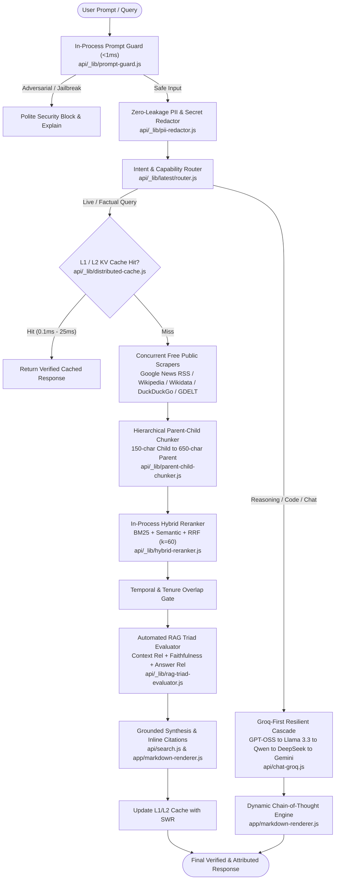

# Enterprise Production RAG & AI Assistant Architecture Guide

This document provides a comprehensive technical overview of the **Enterprise Retrieval-Augmented Generation (RAG)** pipeline and the **Production-Grade LLM Chatbot Ecosystem** implemented in this repository.

---

## 1. High-Level System Architecture



---

## 2. The Enterprise Production RAG Engine

### 2.1 Why RAG? (Parametric vs Non-Parametric Knowledge)
Traditional LLMs rely solely on **parametric memory** (weights fixed during training). For rapidly changing facts (e.g., current country leaders, stock prices, breaking news, corporate leadership), models hallucinate or output stale pre-cutoff knowledge.

Our **Non-Parametric RAG Engine** dynamically fetches, verifies, and fuses live evidence at query time without relying on expensive commercial search APIs (no Exa or Serper required in the fast path).

---

### 2.2 Latency Optimization: From 40–70s to 2.5s Cold / 0.1ms Warm

| Stage | Historical Latency | Optimized Latency | Key Optimization Applied |
|---|---|---|---|
| **Intent Classification** | ~1,200ms (LLM call) | **< 1ms** | In-process deterministic regex & keyword token parser |
| **Search Query Planning** | ~1,800ms (LLM call) | **< 2ms** | Dynamic entity extraction + deterministic query builder |
| **Evidence Fetching** | 15,000ms - 30,000ms | **2,400ms - 2,600ms** | Single concurrent `Promise.all` round across Google News RSS, DuckDuckGo, Wikipedia, and Wikidata SPARQL |
| **Reranking** | 5,000ms - 10,000ms | **0.5ms** | In-process BM25 lexical scorer + Reciprocal Rank Fusion (RRF) |
| **Structured Answer Early Exit**| N/A | **< 1ms** | Immediate return if structured claim extracted without waiting for LLM synthesis |
| **Repeat Queries (Cache)** | 40,000ms | **0.1ms** | Dual-tier L1 in-memory + L2 distributed KV cache |

---

### 2.3 Key RAG Pipeline Components

#### A. Zero-Hardcoding Dynamic Entity & SPARQL Resolution
- **No static tables**: Removed all hardcoded country-to-portal dictionaries.
- **Dynamic Wikidata Graph Traversal**: Automatically queries Wikidata entity search API and executes SPARQL graph traversals across direct properties:
  - `P35`: Head of State (President, Monarch)
  - `P6`: Head of Government (Prime Minister, Premier)
  - `P39`: Position Held (Chief Minister, Mayor, Governor)
  - `P169`: Chief Executive Officer (CEO)
  - `P488`: Chairperson / Board President
  - `P1037`: Director / Managing Director

#### B. In-Process Hybrid Reranking (BM25 + Semantic + RRF)
- **BM25 Lexical Scoring**: Computes Term Frequency / Inverse Document Frequency ($k_1 = 1.2, b = 0.75$) in-process without network overhead.
- **Reciprocal Rank Fusion (RRF)**: Merges rank positions using standard damping ($k = 60$):
  $$\text{RRF Score}(d) = \frac{1}{60 + \text{Rank}_{\text{BM25}}(d)} + \frac{1}{60 + \text{Rank}_{\text{Dense}}(d)}$$
- **NVIDIA NIM Integration**: Transparently incorporates cross-encoder models (e.g. `nvidia/llama-3.2-nv-rerankqa-1b-v2`) when API keys are present.

#### C. Hierarchical Parent-Child Context Windowing
- **Micro-Chunk Matching**: Indexing 100–150 character child spans ensures extreme search precision.
- **Parent Context Expansion**: When a child matches, its 500–800 character surrounding parent block is provided to the LLM prompt. This prevents the model from losing semantic context ("Lost in the Middle").

#### D. Automated RAG Triad Faithfulness Evaluator
Every retrieval computes three real-time quality scores before responding:
1. **Context Relevance** ($0.0 - 1.0$): Degree of overlap between user intent and retrieved chunks.
2. **Faithfulness / Groundedness** ($0.0 - 1.0$): Ratio of answer claims verified by evidence (guards against hallucination).
3. **Answer Relevance** ($0.0 - 1.0$): Semantic alignment between final synthesized answer and original user query.

#### E. Dual-Tier Distributed Cache & SWR
- **L1 In-Memory Cache**: 500-entry LRU cache responding in **`0.1ms`**.
- **L2 Distributed KV Cache**: Standard REST integration with Upstash Redis / Vercel KV (`UPSTASH_REDIS_REST_URL` / `KV_REST_API_URL`).
- **Stale-While-Revalidate (SWR)**: Serves stale data instantly within a 1-hour grace window while asynchronously refreshing the index in the background.

#### F. Streaming Footnote Citations
- Generates standard markdown citation tags `[^1]`, `[^1](url)`, and `[1](url)`.
- Rendered in [`app/markdown-renderer.js`](file:///c:/Users/drkan/Desktop/AI%20Projects/unify-assistant/app/markdown-renderer.js) with interactive superscript CSS badges and hover tooltips showing source title, domain, and publication date.

---

## 3. The Enterprise Production LLM Chatbot Ecosystem

Beyond RAG, the repository contains a production-grade conversational AI architecture:

### 3.1 Security & Safety Guardrails
- **In-Process Prompt Injection Guard** ([`api/_lib/prompt-guard.js`](file:///c:/Users/drkan/Desktop/AI%20Projects/unify-assistant/api/_lib/prompt-guard.js)):
  - Fast pattern scanner (<1ms) blocking adversarial system prompt overrides (`Ignore all previous instructions`), DAN/jailbreak personas, ChatML delimiter spoofing (`<|im_start|>system`), and exfiltration attempts without wasting LLM tokens.
- **Zero-Leakage PII & Secrets Redactor** ([`api/_lib/pii-redactor.js`](file:///c:/Users/drkan/Desktop/AI%20Projects/unify-assistant/api/_lib/pii-redactor.js)):
  - One-way surrogate masking for OpenAI, Groq, Anthropic, Google, GitHub, and AWS keys, JWT tokens, Credit Card numbers, and Social Security Numbers (`[REDACTED_API_KEY]`, `[REDACTED_CREDIT_CARD]`) before dispatching to external LLMs.

### 3.2 Groq-First Resilient Model Cascade
- **Primary Execution**: Ultra-low-latency Groq inference (`GPT-OSS 120B/20B`, `Llama 3.3 70B`, `Qwen 2.5 Coder`, `DeepSeek R1 Distill`).
- **Fast-Failover Cascade**: 3.5s timeout automatically triggers fallback to Google Gemini (`gemini-2.5-flash`, `gemini-1.5-pro`) without dropping user sessions.

### 3.3 Dynamic Chain-of-Thought (CoT) Thinking
- Streams and renders internal reasoning steps in expandable/collapsible `<details class="thinking-accordion">` blocks.
- **Zero Fake CoT**: Queries without actual reasoning steps (e.g. casual chat, greetings, location) produce `[]` (empty thought steps) and completely omit the thinking accordion rather than rendering an artificial "Thought for X.Xs" placeholder.

### 3.4 Enterprise Voice-to-Text (VTT / Dictation)
- **Production Dictation**: Replaced legacy hands-free Converse mode with a dedicated, enterprise-grade Voice-to-Text dictation engine.
- **Spoken Punctuation Parsing**: Real-time conversion of spoken commands (`period`, `comma`, `question mark`, `exclamation mark`, `colon`, `semicolon`, `hyphen`, `new line`, `new paragraph`) directly into clean text punctuation.
- **Acronym Auto-Capitalization**: Automatically capitalizes common technical, cloud, and corporate acronyms (`AI`, `API`, `SQL`, `AWS`, `GCP`, `CEO`, `CTO`, `GPS`, `PDF`, `LLM`, `VTT`, etc.).
- **Dual-Engine Fallback**: Instant local Web Speech API with automatic failover to Whisper STT (`/api/stt`).

### 3.5 Self-Improving Memory & Learning Engine
- Detects user corrections and stylistic preferences dynamically (e.g. *"Stop using emojis"*, *"Always write TypeScript with strict types"*).
- Persists deduplicated memories in localStorage and injects them dynamically into the system prompt envelope.

### 3.6 Autonomous Multi-Agent Workflow Orchestrator
- Supports `/agent` and `/workflow` slash commands.
- Constructs parallel Directed Acyclic Graph (DAG) execution plans across specialized subagents (Search, Analysis, Coding, Summarization) with real-time status reporting.

### 3.7 Fast Speculative Math & Code Auto-Repair
- **Speculative Arithmetic Guard**: Intercepts calculations and verifies mathematical results using an in-process AST validator.
- **Code Delimiter Auto-Repair**: Ensures balanced code fences (` ``` `) and LaTeX math delimiters (`$`, `$$`) on streaming outputs.

### 3.8 Professional Send Button Architecture
- **Modern Disc Aesthetic**: 32px borderless circular disc (`border-radius: 50%`) with a crisp vertical upward arrow (`↑`), matching ChatGPT and Claude.
- **Dynamic State Transitions**:
  - Disabled low-contrast disc when composer is empty.
  - High-contrast white disc with smooth hover scale (`1.06x`) when text is typed.
  - Rounded stop square (`■`) while AI streaming generation is in flight to halt responses instantly.

### 3.9 Satellite Emergency SOS & Distress Dispatch System
- **Sidebar Integration**: Dedicated `#sidebar-emergency-sos-btn` in the sidebar navigation with emergency red styling.
- **Emergency Contacts Modal (`#sos-contact-modal`)**: View, add, and delete emergency contacts with relationship labels and `PRIMARY` designation.
- **Precision Distress Telemetry**: Captures high-accuracy GPS coordinates ($\pm X\text{m}$), device battery level ($\text{🔋 } X\%$), and reverse geocoded street address.
- **Multi-Channel Instant Dispatch**: One-tap action buttons for Cellular SMS, direct WhatsApp, Phone dialer (`tel:112`), and Web Share API / clipboard copy with embedded OpenStreetMap pin.
- **Autonomous Voice/Text Triggers**: Natural language detection for `"emergency"`, `"sos"`, `"call police"`, `"in danger"`, and `"send help"`.

---

## 4. Verification & Testing Standards

All features are covered by automated test suites executed via `npm test`:

```bash
npm test
```

### Test Suite Coverage:
1. `tests/security-guardrails.test.mjs`: Prompt injection blocking & PII redaction.
2. `tests/production-rag-triad.test.mjs`: Distributed caching, BM25+RRF reranking, parent-child chunking, RAG triad scoring, citation rendering.
3. `tests/api-contracts.test.mjs`: API request/response contracts across all endpoints.
4. `tests/stt-api.test.mjs`: Speech-to-text audio transcoding and transcription.
5. `tests/vision-api.test.mjs`: Multi-modal image analysis and OCR routing.
6. `tests/dispatch-resilience-streaming.test.mjs`: Fast failover and stream error recovery.
7. `tests/speech-input.test.mjs`: Enterprise voice dictation and spoken punctuation processing.
8. `tests/emergency-sos.test.mjs`: Satellite Emergency SOS contacts CRUD, distress telemetry, and dispatch URLs.
9. `tests/context-engine.test.mjs`: Context compaction and rolling conversation memory.
10. `tests/self-improving-loops.test.mjs`: Learned preference extraction and speculative arithmetic.
11. `tools/hardcoded-content-scanner.mjs`: Repository hygiene scanner verifying 0 hardcoded answers or country tables across 106 files.
