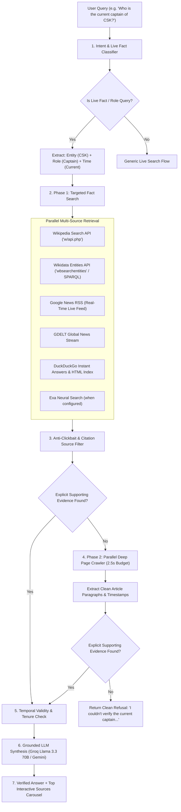

# JARVIS Live Web Search & Deep Crawler Architecture

This document provides a comprehensive technical overview of the **Live Web Search & Deep RAG Retrieval Pipeline** in JARVIS, detailing the end-to-end flow, query parsing, crawler subsystems, temporal verification rules, anti-hallucination guardrails, and zero-hardcoding invariants.

---

## 1. High-Level Architecture Flow



---

## 2. Zero-Hardcoding Invariant

JARVIS operates under a strict **Zero-Hardcoding Guarantee**:
* **No static entity dictionaries, sports team lists, election catalogs, or canned answer tables exist in the codebase.**
* All acronyms (e.g., `CSK`, `FCB`, `NASA`, `WHO`), corporate entities, and government offices are resolved **100% dynamically** at runtime via live public APIs.
* **Automated Hygiene Scanner (`tools/hardcoded-content-scanner.mjs`)**: Scans all 82 codebase files during testing to enforce zero static factual tables or canned answer dictionaries.

---

## 3. Query Classification & Targeted Fact Extraction

When a user prompt enters the system:

1. **Role & Fact Extraction (`parseGovernmentRoleQuery`)**:
   * Inspects the prompt for leadership, officeholder, corporate, and sports roles:
     * **Sports Roles**: `captain`, `skipper`, `coach`, `manager`
     * **Government & Executive Roles**: `chief minister` (`cm`), `prime minister` (`pm`), `president`, `governor`, `mayor`, `first minister`, `premier`
     * **Corporate Roles**: `ceo`, `chief executive officer`
   * Extracts the target entity/jurisdiction (e.g., `"CSK"`, `"Tamil Nadu"`, `"Apple"`, `"India"`).
   * Identifies temporal intent (`current`, `latest`, `2026`, or historical).

2. **Targeted Query Formulation (`buildWebRagQueryPhases`)**:
   Instead of searching for broad topics (which retrieve noise like *"MS Dhoni's future"* or *"IPL history"*), the engine formulates precise, fact-bearing search queries:
   * `[Entity] current [Role]` &rarr; `"CSK current captain"`
   * `[Entity] [Role] 2026` &rarr; `"CSK captain 2026"`
   * `[Entity] [Role]` &rarr; `"CSK captain"`
   * `[Entity] [Role] official` &rarr; `"CSK captain official"`
   * `[Entity] [Role] Wikipedia` &rarr; `"CSK captain Wikipedia"`

---

## 4. Crawlers & Retrieval Subsystems

JARVIS employs a multi-tiered, parallel crawling and retrieval architecture:

### A. Dynamic Public Knowledge APIs
* **Wikipedia OpenSearch API (`https://en.wikipedia.org/w/api.php?action=query&list=search`)**:
  Searches encyclopedic articles and seasonal pages (e.g. *2026 Chennai Super Kings season*) dynamically.
* **Wikidata Entities API & SPARQL (`wbsearchentities` & query service)**:
  Queries structured entity claims (`P35` Head of State, `P6` Head of Government, `P169` CEO, `P39` Office Held).
* **Google News RSS Feed**:
  Fetches live publisher articles in real-time, extracting direct article titles, source metadata, and publication timestamps.
* **GDELT Project Event API**:
  Streams global real-time event coverage and multi-language news citations.
* **DuckDuckGo Web & Instant Answer Index**:
  Retrieves public web search results and structured instant definitions.

### B. Parallel Deep Page Crawler (`crawlArticleBody` & `enrichSearchResultsWithDeepCrawl`)
When search snippets do not contain explicit proof:
1. **Parallel Execution**: Concurrently fetches the full HTML bodies of the top 3–5 candidate URLs.
2. **2,500ms Strict Timeout Budget**: Uses `AbortController` to prevent slow external websites from blocking the response.
3. **DOM Content Extraction**:
   * Strips scripts, styles, advertisements, navigation bars, cookie notices, and footers.
   * Extracts clean, structured article text (up to 2,500 characters per page).
   * Extracts publication and modification dates from `<meta property="article:published_time">` and JSON-LD schema.

---

## 5. Evidence-First Verification vs. Semantic Relatedness

A core principle of the engine is that **semantic relatedness does NOT equal answer evidence**:

```
❌ Related (Rejected): "IPL 2026: MS Dhoni's future with CSK remains open as management plans..."
❌ Speculative (Rejected): "IPL 2026: 'Sanju Samson will captain CSK' - Ashwin makes bold claim..."
✅ Explicit Evidence (Accepted): "Ruturaj Gaikwad was confirmed to lead Chennai Super Kings as captain for the season..."
```

### Verification Safeguards:
1. **Explicit Role-Holder Assertion**:
   Evidence must explicitly link the entity and a named person in a leadership capacity (e.g., `captained by [Name]`, `is the captain of [Entity]`, `[Name] (captain)`, `[Name] is the Chief Minister of [Entity]`).
2. **Anti-Clickbait & Rumor Filter (`isValidCitationSource`)**:
   Headlines and snippets containing speculation markers (`makes bold claim`, `bold claim`, `will captain`, `could captain`, `predicted to captain`, `maybe`, `rumour`, `opinion poll`, `suggests`, `urges`, `WATCH`) are strictly rejected.
3. **Temporal Succession Grounding (`validateClaimTemporalStatus`)**:
   * Evaluates tenure start/end dates and verb tenses (`is/serves` vs. `was/served from 2018 to 2023`).
   * Ensures historical predecessors are demoted and never declared as active incumbents.
4. **Zero Publication-Date Bias**:
   A recent article date (e.g., published today) discussing a past event is not accepted as proof of current status.

---

## 6. Grounded LLM Synthesis & Fail-Closed Behavior

1. **Constrained Prompting**:
   The synthesis model (Groq Llama 3.3 70B with automatic fallback to Google Gemini 2.5 Flash) receives **only verified evidence blocks**.
2. **Concise Format**:
   * Verified output is concise and direct:
     `"[Person] is the current [Role] of [Entity]."`
   * Historical or background trivia is excluded unless explicitly requested.
3. **Clean Refusal on Insufficient Evidence**:
   If evidence does not explicitly establish the fact, the engine does not guess or explain snippets. It returns:
   `"I couldn't verify the current [role] from reliable live sources."` with `verified: false`.

---

## 7. Clean Frontend Source Presentation

* **Top Interactive Sources Carousel (`🌐 SOURCES (X VERIFIED)`)**:
  Renders at the top of the message bubble with domain favicons, source titles, verified numbering badges, and direct links.
* **Zero Bottom Clutter**:
  Redundant bottom source lists and duplicate plain-text links are suppressed to keep the chat interface clean and readable.
* **Continuous Thinking Lifecycle**:
  The thinking indicator (`Searching live sources...` &rarr; `Synthesizing answer...`) remains active until the first byte of the verified answer arrives.

---

## 8. Verification & Test Suite

The live search and RAG architecture is validated across **82 automated test suites** (`npm test`):
* `test:api`: API contracts, live RAG synthesis, Exa fallback, and streaming SSE.
* `test:deterministic`: Fast-path deterministic fact verifiers and routing invariants.
* `test:verification`: Entity verifiers, temporal claim validation, and tool dispatchers.
* `test:hygiene`: Security audit, clean DOM standards, and 0-hardcoded content verification.
