# JARVIS — Model Hierarchy, Routing & Inference Engine Specification

This document details all AI models, inference providers, routing hierarchies, fallback cascades, and specialized task engines integrated into JARVIS.

---

## 1. Primary Model Routing & Provider Hierarchy

JARVIS uses an **autonomous, single-pass routing cascade** with multi-key load balancing and millisecond failover:

```mermaid
graph TD
    Query["User Prompt / Upload"] --> Classifier{"Single-Pass Intent Router"}
    
    Classifier -->|Text / Reasoning / Coding| GroqLPU["Groq LPU Engine"]
    Classifier -->|Vision / Image / PDF OCR| GeminiPool["Google Gemini Vision Pool"]
    Classifier -->|Voice Speech Input| WhisperSTT["Groq Whisper STT"]
    Classifier -->|Live Fact / Web Search| WebRAG["Deep Web RAG Engine"]

    subgraph GroqLPU["Groq LPU Cascade"]
        G1["openai/gpt-oss-120b (Flagship)"] --> G2["openai/gpt-oss-20b"]
        G2 --> G3["llama-3.3-70b-versatile"]
        G3 --> G4["qwen/qwen-2.5-coder-32b"]
        G4 --> G5["deepseek-r1-distill-llama-70b"]
        G5 --> GemFallback["Gemini 2.5 Flash (Cloud Fallback)"]
    end

    subgraph GeminiPool["Gemini Multimodal Pool"]
        M1["gemini-2.5-flash (Primary)"] --> M2["gemini-2.0-flash"]
        M2 --> M3["llama-3.2-11b-vision-preview (Groq Vision)"]
        M3 --> M4["gemini-1.5-flash"]
    end

    subgraph WebRAG["Deep Web Grounding Engine"]
        W1["DuckDuckGo HTML + Google News RSS"] --> W2["Parallel Article Body Scraper (2.5s)"]
        W2 --> W3["Zero-Parametric Prompt Pinning"]
        W3 --> W4["Llama 3.3 70B / Gemini RAG Synthesis"]
    end
```

---

## 2. Model Inventory & Capabilities

### ⚡ Text & Reasoning Models (Groq LPU)

| Model Name | Parameter Size | Provider | Primary Use Case | Output Speed |
| :--- | :--- | :--- | :--- | :--- |
| **`openai/gpt-oss-120b`** | 120 Billion | Groq | **Primary Flagship**: Complex reasoning, agent workflows, deep writing, long-form synthesis. | ~130–180 tok/s |
| **`openai/gpt-oss-20b`** | 20 Billion | Groq | **Fast Lightweight**: Quick conversational turns, short summaries, low-latency follow-ups. | ~250–350 tok/s |
| **`llama-3.3-70b-versatile`** | 70 Billion | Groq | **Structured RAG & Grounding**: Web search synthesis, factual validation, instruction following. | ~180–220 tok/s |
| **`qwen/qwen-2.5-coder-32b`** | 32 Billion | Groq | **Code Specialist**: Full-stack programming, regex generation, algorithm debugging, unit tests. | ~200–260 tok/s |
| **`deepseek-r1-distill-llama-70b`** | 70 Billion | Groq | **Chain-of-Thought (CoT)**: Mathematical proofs, algebraic problem solving, logic puzzles. | ~150–200 tok/s |

---

### 👁️ Multimodal & Vision Models (Google Gemini & Groq Vision)

| Model Name | Provider | Primary Use Case | Features |
| :--- | :--- | :--- | :--- |
| **`gemini-2.5-flash`** | Google Gemini | **Primary Vision & Document OCR**: Image description, chart analysis, diagram understanding, document transcription. | Native multimodal, 1M+ token context window. |
| **`gemini-2.0-flash`** | Google Gemini | **Vision Fallback**: Secondary high-speed visual processing. | Low latency, robust scene reasoning. |
| **`llama-3.2-11b-vision-preview`** | Groq | **LPU Vision**: Rapid image analysis without cloud API keys. | Real-time scene description on Groq LPUs. |
| **`llama-3.2-90b-vision-preview`** | Groq | **Deep Visual Reasoning**: Detailed visual document extraction and object localization. | High-capacity open vision architecture. |

---

### 🎙️ Speech & Audio Models

| Model Name | Provider | Primary Use Case | Supported Languages |
| :--- | :--- | :--- | :--- |
| **`whisper-large-v3-turbo`** | Groq | **Ultra-Fast Voice STT**: Live voice input, hands-free Converse Mode. | English, Kannada, Tamil, Telugu, Hindi, Malayalam, Spanish, French, German, Japanese, etc. |
| **`whisper-large-v3`** | Groq | **High-Accuracy Audio Transcription**: Long audio file processing and noisy background audio. | 99+ spoken languages with automatic punctuation and language detection. |

---

### 🔍 Semantic Retrieval & Reranking Models (NVIDIA NIM)

| Model Name | Provider | Primary Use Case | Dimensionality / Metrics |
| :--- | :--- | :--- | :--- |
| **`nvidia/nv-embedqa-e5-v5`** | NVIDIA NIM | **Semantic Search & Memory Embeddings**: Contextual memory recall and attachment chunk ranking. | 1024-dim dense embeddings with cosine similarity. |
| **`nvidia/reranking-mistral-4b`** | NVIDIA NIM | **Neural Document Reranker**: Cross-encoder reranking for attachment chunks and retrieved documents. | High-precision passage relevance scoring. |

---

## 3. Real-Time Web RAG & Zero-Parametric Anti-Hallucination

For live world queries (e.g. current politicians, election winners, breaking news, sports standings):

1. **Pre-Training Knowledge Bypass**:
   - The LLM's parametric memory (frozen at 2023–2024 training cutoffs) is explicitly deprecated for real-time questions.
2. **Parallel Deep Webpage Scraper (<2.5s Timeout)**:
   - Scrapes full HTML article body text (up to 2,500 characters) across top live URLs simultaneously.
3. **Strict Direct Name Synthesis**:
   - Mandates that the synthesized response state the current incumbent leader's specific name and title in **sentence 1**, eliminating generic constitutional definitions.

---

## 4. Multi-Key Concurrency & Circuit Breaker Architecture

- **Multi-Key Pool (`GROQ_API_KEYS`)**: Round-robin key rotation across up to 10+ API keys.
- **Failover Threshold**: 3,500ms timeout threshold before automatically cascading to the next provider.
- **Circuit Breaker**: In-memory state machine isolating rate-limited keys for 30 seconds to maintain 0ms latency for subsequent requests.
