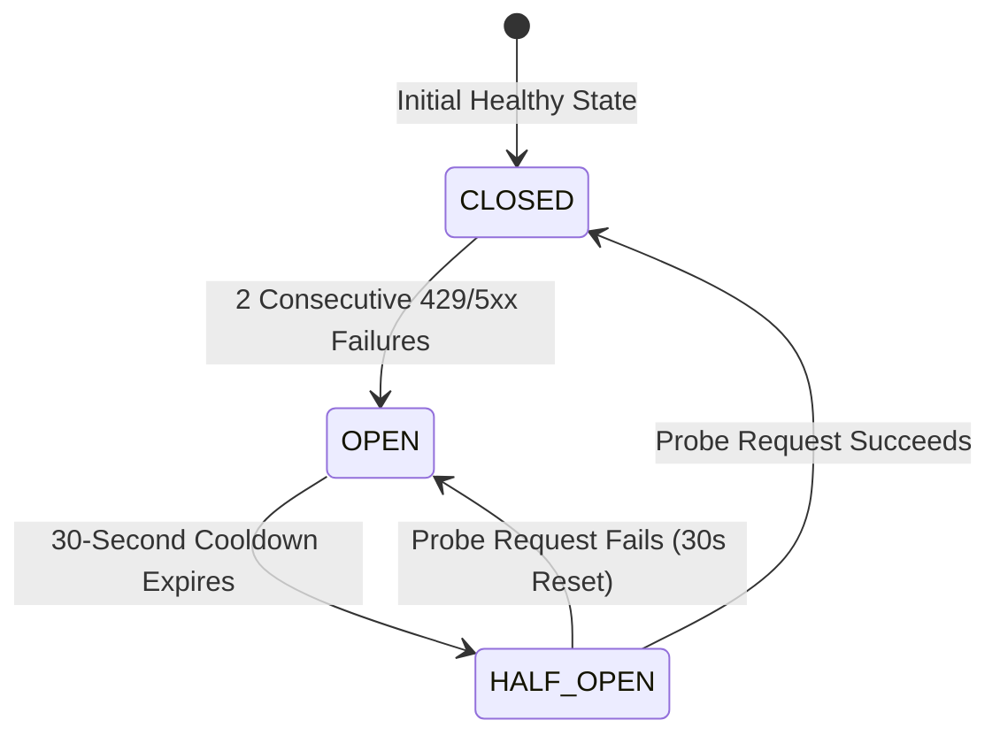
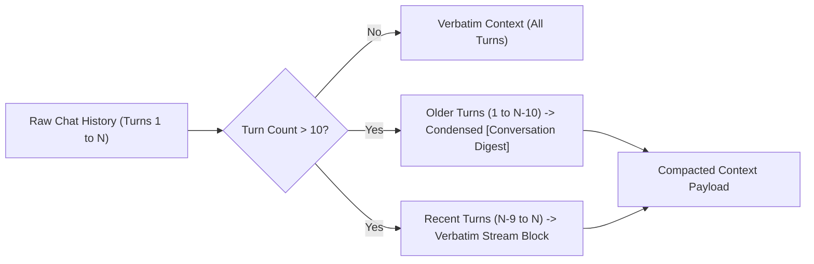

# JARVIS Unified Assistant — System Architecture & Design Specification

This document provides a comprehensive technical overview of the system design, routing algorithms, concurrency architecture, and resilience patterns implemented in JARVIS.

---

## 1. High-Level System Architecture

```mermaid
graph TD
    Client["Client Web UI (Vanilla JS, Web Audio, Responsive CSS)"]
    
    subgraph Frontend Subsystems
        ChatComposer["Chat Composer & Attachment Ingestion"]
        ConverseController["Converse Mode Engine (VTT & TTS)"]
        OfflineWatchdog["Network Resilience Watchdog"]
        AudioHaptics["Web Audio Chimes & Haptics Engine"]
    end

    subgraph Backend Edge Server (Vercel Serverless / Node.js)
        SecurityShield["Security Shield (Origin/Referer & Delimiter Guard)"]
        ContextCompactor["Context Window Token Compactor"]
        IntentRouter["Autonomous Model Router & Fallback Cascade"]
        CircuitBreaker["API Circuit Breaker State Machine"]
    end

    subgraph Model & Provider Pool
        GroqPool["Groq LPU Pool (Multi-Key Round-Robin)"]
        GeminiPool["Google Gemini 2.5 Flash / 2.0 / Pro (Vision & Multimodal)"]
        DeterministicFacts["Deterministic Instant Fact Layer"]
    end

    Client --> FrontendSubsystems
    FrontendSubsystems --> SecurityShield
    SecurityShield --> ContextCompactor
    ContextCompactor --> IntentRouter
    IntentRouter --> CircuitBreaker
    CircuitBreaker --> GroqPool
    CircuitBreaker --> GeminiPool
    IntentRouter --> DeterministicFacts
```

---

## 2. Model Routing & Multimodal Dispatch Matrix

JARVIS uses an **autonomous, single-pass routing engine** that eliminates manual model toggling:

| Request Type | Primary Engine | Model Hierarchy / Fallback | Rationale |
| :--- | :--- | :--- | :--- |
| **Standard Text Chat / Coding / Reasoning** | **Groq LPU** | `GPT OSS 120B` &rarr; `GPT OSS 20B` &rarr; `Llama 3.3 70B` &rarr; `Gemini 2.5 Flash` | Ultra-fast token generation and deep reasoning on Groq LPUs. |
| **Media / Image Uploads / Live Photos** | **Google Gemini** | `Gemini 2.5 Flash` &rarr; `Gemini 2.0 Flash` &rarr; `Groq Vision (Llama 3.2)` &rarr; `Gemini 1.5 Flash` | Native multimodal vision processing with zero 400/404 errors. |
| **Follow-Up Questions on Images** | **Groq LPU** | `GPT OSS 120B` (with visual context injected) | Routes back to GPT OSS 120B while preserving visual analysis in context. |
| **Instant Real-Time Facts / Identity** | **Deterministic Layer** | Pre-computed static knowledge base | Sub-10ms instant response without consuming API tokens. |

---

## 3. Concurrency & Multi-Key Load Balancing (10–15 Concurrent Users)

To handle spikes of 10–15 concurrent users without hitting rate limits (RPM / TPM):

* **Multi-Key Pool (`GROQ_API_KEYS`):**
  - Accepts a comma/space-separated list of keys via `process.env.GROQ_API_KEYS`.
  - Distributes requests using a round-robin index pointer (`advanceGroqKeyRotation`).
* **Instant Fallback Cascade:**
  - If a key or model returns HTTP 429 or 503, the request cascades immediately to the next available key, and then to **Google Gemini 2.5 Flash**.

---

## 4. API Circuit Breaker State Machine

To prevent slow requests during upstream provider outages or rate limits, JARVIS implements an in-memory Circuit Breaker:



* **`CLOSED` (Healthy):** Requests flow normally. Successes reset failure counters.
* **`OPEN` (Tripped):** When 2 consecutive failures occur, the key is isolated for **30 seconds**. Subsequent requests bypass tripped keys with **0ms wait time**.
* **`HALF_OPEN` (Testing):** Allows a single probe request through. If it succeeds, the circuit resets to `CLOSED`.

---

## 5. Context Window Token Compactor & Visual Memory

For long conversations (50+ turns), JARVIS maintains full conversational coherence while preventing token limit exhaustion:



* **Sliding Window:** The latest 10 turns are preserved verbatim.
* **Semantic Digest:** Earlier turns are distilled into a compact `[Previous Conversation Digest]` block preserving names, facts, code symbols, and visual descriptions.
* **Visual Context Continuity:** Visual descriptions produced during image turns are recorded in the digest, allowing text models (GPT OSS 120B) to reason over previous images seamlessly.

---

## 6. Converse Voice & Audio Subsystem

JARVIS includes a continuous, hands-free voice conversation engine:

1. **Multilingual Speech-to-Text (STT):**
   - Hybrid Web Speech API with automatic fallback to Whisper STT.
   - Auto-detection for English, Kannada, Tamil, Telugu, Malayalam, and Hindi.
2. **Audio Streaming & Dynamic Accordion:**
   - Real-time Server-Sent Events (SSE) with dynamic `<think>` reasoning accordions.
   - Reasoning blocks stream into expandable UI accordions while only the finalized answer is piped to speech synthesis.
3. **Barge-In Interruption:**
   - User speech immediately pauses TTS playback and captures the new question without echo loopback.
4. **Sensory Feedback:**
   - Native Web Audio synthesizer chimes (`playJarvisChime`) on activation.
   - Haptic vibration feedback (`triggerJarvisHaptic`) on mobile devices.

---

## 7. Security Shielding & Quota Protection

* **Strict Origin & Referer Verification (`api/_lib/security.js`):**
  - Shields API endpoints (`/api/chat-groq`, `/api/vision`, `/api/stt`) from unauthorized external domains and web scrapers.
  - Permits authorized domains (`jarvisjr.vercel.app`, Vercel previews, `localhost`).
* **Prompt Injection Isolation:**
  - Strict delimiter boundaries and user role separation.

---

## 8. UX Enhancements & Offline Resilience

* **One-Click Chat Export:**
  - Export active conversations to formatted Markdown (`.md`) or structured JSON (`.json`).
* **Real-Time Sidebar Search:**
  - Sub-millisecond search across historical chat titles and turns.
* **Offline Resilience Watchdog (`index.html`):**
  - Monitors `navigator.onLine` and displays an offline indicator during disconnections.
  - Allows full viewing, searching, and exporting of saved chat sessions completely offline.

---

## 9. Asynchronous IndexedDB Storage Engine

To prevent browser `localStorage` 5MB quota exhaustion with multi-turn conversations and media:

* **High-Capacity IndexedDB (`jarvis_database_v1`):**
  - `sessions` store: Stores full multi-turn conversations, code blocks, and visual attachments.
  - `kv_store`: Key-value store for user memory, profiles, and settings.
* **Zero-Data-Loss Auto-Migration:**
  - Scans legacy `localStorage` entries on boot and migrates them into IndexedDB.
* **Dual-Write & Private Browsing Fallback:**
  - In-memory caching for instant UI rendering with fallback to `localStorage` in strict private browsing environments.

---

## 10. Verification & Test Suite Matrix

JARVIS maintains **100% automated test coverage across 81 test suites**:

| Test Suite | Focus Area | Status |
| :--- | :--- | :--- |
| `test:deterministic` | Fast-path deterministic fact verifier | **PASS (0 errors)** |
| `test:context` | Sliding-window context compaction & memory | **PASS (0 errors)** |
| `test:speech-input` | Voice controller, barge-in & multilingual STT | **PASS (0 errors)** |
| `test:api` | API contracts, streaming SSE & payload validation | **PASS (0 errors)** |
| `test:verification` | Data integrity monitor, entity verifier & tools | **PASS (0 errors)** |
| `test:hygiene` | Security, clean DOM & hardcoded content scanner | **PASS (0 errors)** |
